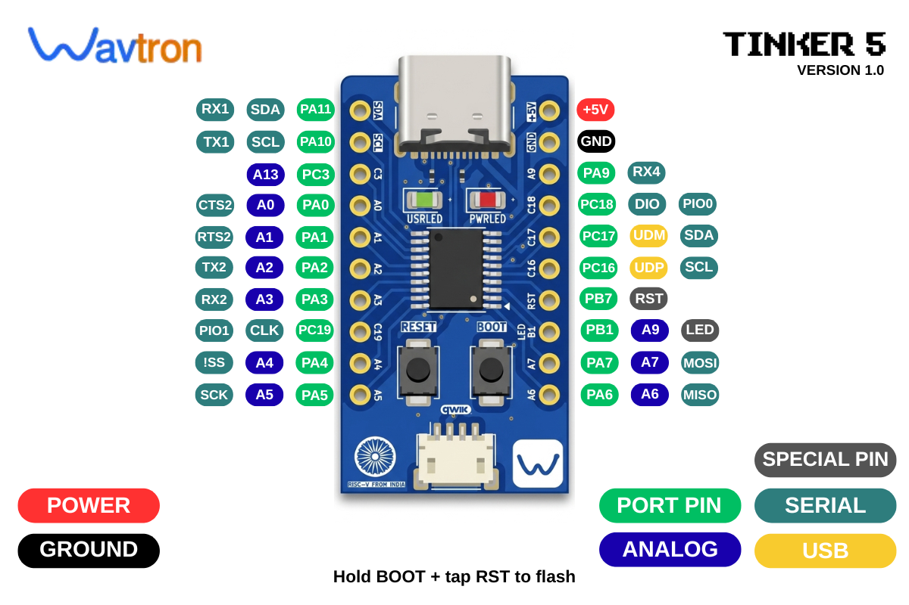

<p align="center">

</p>

<h1 align="center">Wavtron Tinker 5</h1>

<p align="center">
  <b>A RISC-V development board, built in India.</b><br>
  Native USB · No external programmer · QWIIC I²C · Nano-compatible footprint
</p>

<p align="center">
  
  
  
  
</p>

---

## Table of Contents

- [What is Tinker 5](#what-is-tinker-5)
- [Specifications](#specifications)
- [Pinout](#pinout)
- [Getting Started](#getting-started)
  - [1. Install Arduino IDE Board Package](#1-install-arduino-ide-board-package)
  - [2. Write and Compile Your Sketch](#2-write-and-compile-your-sketch)
  - [3. Flash With WCHISPTool](#3-flash-with-wchisptool)
  - [4. Understanding BOOT and RESET](#4-understanding-boot-and-reset)
  - [5. Multi-Function Reset Pin Setting](#5-multi-function-reset-pin-setting)
- [QWIIC / I²C Connector](#qwiic--i2c-connector)
- [Compatible IDEs](#compatible-ides)
- [Schematic](#schematic)
- [Datasheet](#datasheet)
- [Examples](#examples)
- [Troubleshooting](#troubleshooting)
- [Repository Structure](#repository-structure)
- [Where to Buy](#where-to-buy)
- [License](#license)

---

## What is Tinker 5

Tinker 5 is a compact RISC-V development board designed around the WCH CH32X033F8P6 — a microcontroller with a native USB 2.0 peripheral and a factory-burned USB bootloader. That means you can flash code onto it using nothing but a USB-C cable — no WCH-LinkE, no SWD probe, no extra hardware.

It's built on the same footprint as an Arduino Nano, so it drops into existing breadboards and protoboards without redesigning anything, and it adds a QWIIC-style JST-SH I²C connector for fast sensor hookup.

This board is fully open — schematic, pinout, and firmware examples are all in this repository.

---

## Specifications

| | |
|---|---|
| **MCU** | WCH CH32X033F8P6 (TSSOP-20) |
| **Core** | QingKe V4C, RISC-V RV32IMAC |
| **Clock** | 48 MHz internal RC oscillator (no external crystal) |
| **Flash** | 62 KB |
| **SRAM** | 20 KB |
| **USB** | Native USB 2.0 Full Speed, factory USB bootloader |
| **Programming** | USB-C, via WCHISPTool (no external programmer) |
| **I²C Connector** | JST-SH 4-pin, QWIIC-style pinout, runs at **5V** |
| **LEDs** | PWRLED (power), USRLED (user-controllable, PB1) |
| **Buttons** | BOOT, RESET |
| **Form Factor** | Nano-compatible, breadboard-friendly |
| **Power Input** | USB-C, 5V |
| **Origin** | Designed and assembled in India 🇮🇳 |

---

## Pinout

<p align="center">
  
</p>

### Left Header (top → bottom)

| Pin | Label(s) | GPIO | Notes |
|---|---|---|---|
| 1 | RX1 / SDA | PA11 | I²C SDA, UART1 RX, also on QWIIC |
| 2 | TX1 / SCL | PA10 | I²C SCL, UART1 TX, also on QWIIC |
| 3 | A13 | PC3 | ADC, analog input |
| 4 | CTS2 / A0 | PA0 | ADC, UART2 CTS |
| 5 | RTS2 / A1 | PA1 | ADC, UART2 RTS |
| 6 | TX2 / A2 | PA2 | ADC, UART2 TX |
| 7 | RX2 / A3 | PA3 | ADC, UART2 RX |
| 8 | PIO1 / CLK | PC19 | GPIO, PIO |
| 9 | !SS / A4 | PA4 | ADC, SPI Chip Select |
| 10 | SCK / A5 | PA5 | ADC, SPI Clock |

### Right Header (top → bottom)

| Pin | Label(s) | GPIO | Notes |
|---|---|---|---|
| 1 | +5V | — | Power in/out |
| 2 | GND | — | Ground |
| 3 | RX4 / A9 | PA9 | ADC, UART4 RX |
| 4 | DIO / PIO0 | PC18 | GPIO, PIO |
| 5 | UDM / SDA | PC17 | USB D-, alt I²C SDA |
| 6 | UDP / SCL | PC16 | USB D+, alt I²C SCL |
| 7 | RST | PB7 | Reset (also multi-function GPIO — see below) |
| 8 | A9 / LED | PB1 | User LED (USRLED), GPIO |
| 9 | MOSI / A7 | PA7 | ADC, SPI MOSI |
| 10 | MISO / A6 | PA6 | ADC, SPI MISO |

### Legend

- 🔴 **Power** — voltage rails
- ⚫ **Ground**
- 🟢 **Port Pin** — general GPIO
- 🔵 **Analog** — ADC-capable
- 🟡 **USB** — USB D+/D- lines
- 🟦 **Serial** — UART/I²C
- ⚪ **Special Pin** — reset, boot, etc.

---

## Getting Started

Tinker 5 uses a **two-step programming workflow**: compile in Arduino IDE, then flash using WCH's official ISP tool. This is because the board relies on CH32X033's native USB bootloader rather than a serial COM port, so Arduino IDE's built-in "Upload" button isn't used directly — instead, you export a compiled binary and flash it with WCHISPTool.

### 1. Install Arduino IDE Board Package

1. Download and install [Arduino IDE](https://www.arduino.cc/en/software) (2.x recommended)
2. Open **File → Preferences**
3. Paste this URL into **Additional Boards Manager URLs**:
   ```
   https://github.com/openwch/board_manager_files/raw/main/package_ch32v_index.json
   ```
4. Go to **Tools → Board → Boards Manager**
5. Search **WCH** → Install **"WCH CH32 MCU Boards"**

### 2. Write and Compile Your Sketch

1. **Tools → Board →** select **CH32X035G8U EVT** (CH32X033F8P6 shares this core)
2. **Tools → Board Select →** choose the matching sub-variant if prompted
3. Write your sketch as normal
4. **Sketch → Export Compiled Binary**
   - This generates a `.hex` file inside your sketch folder (or a `build/` subfolder)
   - This is the file you will flash in the next step

### 3. Flash With WCHISPTool

1. Download **WCHISPTool** from WCH's official downloads page
2. Open WCHISPTool
3. Set:
   - **Chip Series:** `CH32X03x`
   - **Chip Model:** `CH32X033F8P`
   - **Dnld Port:** `USB`
4. Put the board into **bootloader mode** (see next section)
5. Click **Search** — your board should appear under **Dev List**
6. Select your board from the list
7. Click **"..."** next to **Object File1** and browse to the `.hex` file exported from Arduino IDE
8. Click **Download**

Your code is now running on the board.

### 4. Understanding BOOT and RESET

Tinker 5 has two buttons:

- **BOOT** — forces the chip into its USB bootloader on the next reset, instead of running your program
- **RESET** — restarts the chip

**To enter bootloader mode for flashing:**

1. Press and **hold BOOT**
2. While still holding BOOT, plug in the USB cable (or press **RESET** once if already plugged in)
3. Keep holding BOOT for ~2–3 seconds
4. Release BOOT

The board is now in bootloader mode and ready for WCHISPTool to detect it. After flashing, the board automatically resets and runs your program — BOOT is not needed again until you want to flash new code.

### 5. Multi-Function Reset Pin Setting

By default, the **RST pin (PB7)** may be configured as a general-purpose I/O pin rather than a dedicated hardware reset — this depends on a chip option byte, not just the physical button.

If your **RESET button stops working** (board won't reset, or won't re-enter bootloader mode via RESET), check this setting in WCHISPTool:

1. Open WCHISPTool with your board connected in bootloader mode
2. Look under **Download Config → Chip Config**
3. Find **"RST multiplexing is an external pin reset"**
4. Ensure this is set correctly for your use case:
   - **Enabled** → PB7 acts as a hardware RESET (recommended for normal use)
   - **Disabled** → PB7 becomes a regular GPIO pin (only do this if you specifically need that pin for I/O and don't need the RESET button)

This is a one-time chip configuration — once set, it persists across reflashes until changed again.

---

## QWIIC / I²C Connector

Tinker 5 has a 4-pin JST-SH connector wired for QWIIC-style plug-and-play I²C.

| Pin | Signal |
|---|---|
| 1 | GND |
| 2 | 5V |
| 3 | SDA (PA11) |
| 4 | SCL (PA10) |

> ⚠️ **Important:** this connector runs at **5V logic**, not the 3.3V used by standard SparkFun/Adafruit QWIIC devices. Check the voltage tolerance of any QWIIC sensor before connecting — some 3.3V-only sensors can be damaged by 5V I²C lines.

---

## Compatible IDEs

| IDE | Support |
|---|---|
| **Arduino IDE** | ✅ Compile sketches, export binary, flash via WCHISPTool |
| **MounRiver Studio** | ✅ Full native support (WCH's official IDE), including direct debug |
| **PlatformIO** | ⚠️ Community core support varies — not officially tested for this board yet |

---

## Schematic

Full schematic is available at [`hardware/Tinker5_Schematic.pdf`](hardware/Tinker5_Schematic.pdf).

**Key sections:**
- USB & Power Port (USB-C connector, CC resistors, VBUS)
- Reset & Boot Buttons (PB7/RST, PC17/BOOT)
- Power & User LEDs (PWRLED, USRLED)
- Decoupling Capacitors
- Microcontroller Section (CH32X033F8P6 full pin mapping)
- Header Section (left/right header connections)
- I²C Connector (JST-SH QWIIC)

---

## Datasheet

Official CH32X033/CH32X035 datasheet (WCH):
**[CH32X035DS0.PDF](https://www.wch-ic.com/downloads/CH32X035DS0_PDF.html)**

Reference manual:
**[CH32X035RM.PDF](https://www.wch-ic.com/downloads/CH32xRM_PDF.html)**

Product page: [wch.cn/products/CH32X035.html](https://www.wch.cn/products/CH32X035.html)

---

## Examples

### Blink (USRLED)

```cpp
void setup() {
  pinMode(PB1, OUTPUT);
}

void loop() {
  digitalWrite(PB1, HIGH);
  delay(500);
  digitalWrite(PB1, LOW);
  delay(500);
}
```

### I²C Scanner

```cpp
#include <Wire.h>

void setup() {
  Wire.begin();
  Serial.begin(115200);
}

void loop() {
  for (byte addr = 1; addr < 127; addr++) {
    Wire.beginTransmission(addr);
    if (Wire.endTransmission() == 0) {
      Serial.print("Found device at 0x");
      Serial.println(addr, HEX);
    }
  }
  delay(2000);
}
```

More examples: [`examples/`](examples/)

---

## Troubleshooting

**Board doesn't appear in WCHISPTool Dev List:**
- Confirm you're holding BOOT *before* plugging in USB, not after
- Try a different USB cable — must support data, not charge-only
- Check Windows Device Manager for an "Unknown Device" appearing when BOOT is held — if nothing appears at all, check USB-C soldering continuity

**Windows shows "Unknown Device" / Code 28:**
- Install WCH's official CH375 driver — see [`docs/getting_started.md`](docs/getting_started.md) or WCH's downloads page

**RESET button doesn't work:**
- Check the "RST multiplexing" option in WCHISPTool — see [Multi-Function Reset Pin Setting](#5-multi-function-reset-pin-setting) above

**I²C devices not detected:**
- Confirm your sensor is 5V-tolerant — this board's QWIIC connector runs at 5V, not 3.3V
- Run the I²C Scanner example above to confirm bus activity

---

## Repository Structure

```
Wavtron_Tinker5/
├── README.md                    ← you are here
├── LICENSE                      ← hardware license (CERN-OHL-W)
├── hardware/
│   └── Tinker5_Schematic.pdf
├── docs/
│   └── images/
│       ├── board_hero.png
│       └── pinout.png
└── examples/
    └── Blink/
        └── Blink.ino
```

---

## Where to Buy

| Region | Store |
|---|---|
| India | [wavtron.in](https://wavtron.in) |
| Global | [Tindie](https://www.tindie.com/stores/wavtron/) |

---

## License

Hardware design files (schematic) are released under the **CERN Open Hardware Licence v2 — Weakly Reciprocal**. See [`LICENSE`](LICENSE).

---

<p align="center">
  <b>Wavtron Tinker 5 — RISC-V FROM INDIA 🇮🇳</b><br>
  <a href="https://wavtron.in">wavtron.in</a>
</p>
